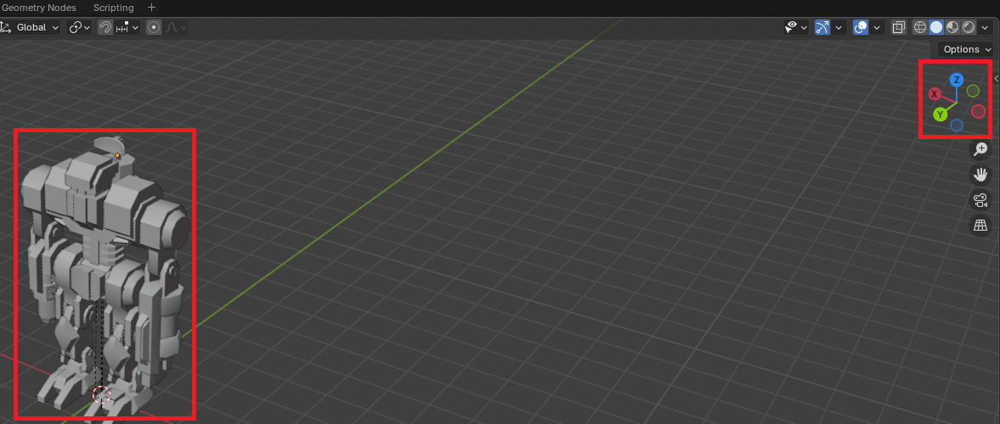
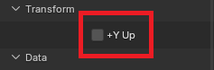
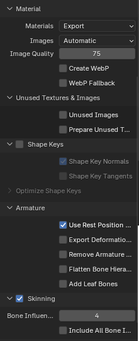
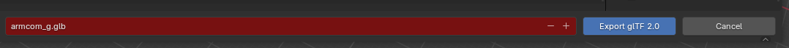
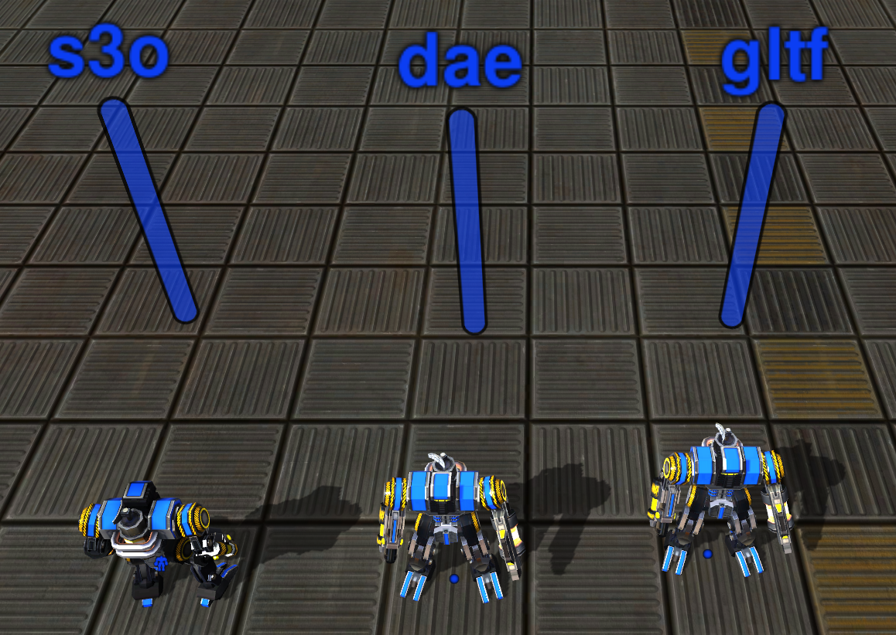

+++
title = "How to import a GLTF file from Blender"
author = "lhog"
+++

## Intro

### Overview

We provide generic information to use GLTF models instead or in addition to the supported Assimp (Collada only, practically speaking) and s3o models. We don't touch on the subjects of modeling, texturing, skinning or animation. Only the technicallities of Blender GLTF exporter and Recoil importer of GLTF.

> [!NOTE]
> The guide is written in a prescriptive way. Try to not deviate from the guide too much, otherwise you may end up in the unsupported territory.

### About GLTF 2.0

The engine has recently introduced support for the [GLTF 2.0](https://registry.khronos.org/glTF/specs/2.0/glTF-2.0.html) model file format. It's also widely supported throughout the industry.

### Why use GLTF in Recoil?

- Widely supported unlike s3o
- Modern and in-trend unlike Collada
- Supports skinning, which Recoil supports. s3o will never have that.
- Supports the embedded animation (future support in Recoil). s3o will never have that either.
- Should load faster than Collada
- The supporting library is self-contained, unlike monstrous Assimp, which we can't update due to sync concerns

### GLTF support in Recoil

- The engine versions after [this commit](https://github.com/beyond-all-reason/RecoilEngine/commit/d20e7f15024db58ade60dff3dbcb9590c94a316a) should have working experimental GLTF support (could still be bugged).
- The only supported primitive type is `Triangles`. `Points`, `Lines`, `LineLoops`, `LineStrips`, `TriangleStrips` and `TriangleFans` are not supported. The last two might be added on demand (and for good reason). The unsupported primitives will cause runtime fatal error
- Skinning is supposed to be supported, but was never tested after initial implementation
- Embedded animation is not supported, but maybe will be supported in the future versions of the engine
- Recoil ignores textures and materials, mostly because they're expected to follow the PBR workflow
- Other vertex attributes, e.g. vertex colors, are not loaded, but can be considered for addition in the future versions of the engine

> [!NOTE]
> We use [S3O Kit](https://github.com/ChrisFloofyKitsune/s3o-blender-tools) to import existing s3o models from Blender. The s3o Kit imports many s3o attributes as separate nodes, you might want to remove them from the model, before exporting it to GLTF2, because they cause creation of extra meaningless pieces. Make sure the model hierarchy is clean of s3o attributes leftovers.

## Export from Blender

### Important things to know

Your model inside Blender SHOULD be positioned Z-up. Effects of other positioning are not explored, most likely it just won't work.

Before you export the model it might be convenient to define the **Scene**'s custom properties that are respected by the Recoil loader

As the properties are custom, you will need to define them for each new model. If better ways are known, feel free to add this to the guide.

The list of supported key-values is following:

| Name              | Type       | Description                                                                                                                                                   |
| ----------------- | ---------- | ------------------------------------------------------------------------------------------------------------------------------------------------------------- |
| `tex1`            | `string`   | Relative path to `tex1` in `UnitTextures` directory, empty by default                                                                                         |
| `tex2`            | `string`   | Relative path to `tex2` in `UnitTextures` directory, empty by default                                                                                         |
| `midpos`          | `float[3]` | Relative middle of the model position, by default calculated based on the model dimensions                                                                    |
| `mins`            | `float[3]` | Minimum bounds of the model, in the model space, by default calculated based on the model dimensions                                                          |
| `maxs`            | `float[3]` | Maximum bounds of the model, in the model space, by default calculated based on the model dimensions                                                          |
| `height`          | `float`    | The height of the model, by default calculated based on the model dimensions                                                                                  |
| `radius`          | `float`    | The radius of the model, by default calculated based on the model dimensions                                                                                  |
| `fliptextures`    | `boolean`  | Whether to flip the supplied `tex1` / `tex2` (if supported by the texture types). `False` by default                                                          |
| `invertteamcolor` | `boolean`  | Whether to inverse the teamcolor in `tex1` (if supported by the texture types). `False` by default                                                            |
| `s3ocompat`       | `boolean`  | Transform the model such that its animation and worldspace position matches those of s3o (left-hand coordinate system). `False` by default. Very experimental |

> [!NOTE]
> You can export any additional attributes not listed above, there's no harm in that

Alternatively all the same keys can be defined in a Lua file, right next to the model, the same as it's done for Collada / `.dae`. Note that only the options above are supported for GLTF format. All the rest Assimp Lua keys and tables are ignored.
If both the custom Scene attributes in the GLTF file and the Lua file are present, the values in the Lua file will take precedence.

### Export step list

1. Go to File --> Export --> glTF 2.0.
   
2. Select `binary glTF format (.glb)` as the file format. Make sure to include `Custom properties` if you chose to define them.
   _`.gltf` (text) format is nice for debugging, the engine might load it, but it's never been tested any thoroughly._
   
3. You MUST make sure to unclick `+Y up`.
   
4. Make sure to export `UVs`, `Normals`, `Tangents`.
   
5. The rest of the settings are listed on the screenshots below.
   
   
6. Finally choose the folder and filename and press `Export glTF 2.0` button.
   

## Load the GLTF model in Recoil

Out of all custom attributes defined in the Scene's GLTF or in the Lua file the two you should probably define in any case are `tex1` and `tex2`. The rest are defined per use case.

In order to load the GLTF model, make sure it resides somewhere in `Objects3d` directory of your game. Next in the Unit / Feature / WeaponDef just reference the model's relative file with `.glb` extension.

### S3O Compat

If you export your existing s3o model as GLTF and reuse the existing animation, made for s3o model and you see your units are walking "backwards", make sure to instruct the importer to try to rotate the model in s3o compatible way (define `s3ocompat` to `true`).

By default, GLTF is imported in the same (right handed) coordinate system as Collada / `.dae` and thus require changes to the animation scripts.

### Nodes hierarchy

The importer will create a few empty top level pieces to accomodate for rotations and other nuances of the importer. This is usually completely transparent to the game devs. This might be optimized later on.
